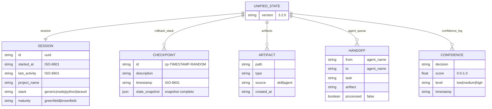

# AI Dev Superpowers v4.4.0 - Documentacao Tecnica Completa

> Documento tecnico de referencia com arquitetura, fluxos detalhados e diagramas.
> Gerado em: 2026-02-16

---

## Sumario

1. [Visao Geral da Arquitetura](#1-visao-geral-da-arquitetura)
2. [Mapa de Modulos (37 libs)](#2-mapa-de-modulos)
3. [Grafo de Dependencias](#3-grafo-de-dependencias)
4. [Fluxo: aidev init](#4-fluxo-aidev-init)
5. [Fluxo: aidev upgrade](#5-fluxo-aidev-upgrade)
6. [Fluxo: aidev release](#6-fluxo-aidev-release)
7. [Fluxo: aidev self-upgrade](#7-fluxo-aidev-self-upgrade)
8. [Fluxo: aidev agent (Orquestracao)](#8-fluxo-aidev-agent)
9. [Sistema de Estado (unified.json)](#9-sistema-de-estado)
10. [Sistema de Manifesto (MANIFEST.json)](#10-sistema-de-manifesto)
11. [LLM Guard (Guardrails)](#11-llm-guard)
12. [Deploy Sync (Local-Global)](#12-deploy-sync)
13. [Matriz de Protecao de Arquivos](#13-matriz-de-protecao)
14. [Analise de Gargalos e Melhorias](#14-gargalos-e-melhorias)

---

## 1. Visao Geral da Arquitetura

### Topologia do Sistema

```mermaid
graph TB
    subgraph GLOBAL["Instalacao Global (~/.aidev-superpowers/)"]
        GBIN["bin/aidev"]
        GLIB["lib/*.sh (37 modulos)"]
        GTMPL["templates/**/*.tmpl"]
        GVER["VERSION (SSOT)"]
        GMANIFEST["MANIFEST.json"]
    end

    subgraph PROJECT["Projeto do Usuario (.aidev/)"]
        PAGENTS["agents/*.md (12)"]
        PSKILLS["skills/*/SKILL.md (8)"]
        PRULES["rules/*.md (2)"]
        PSTATE["state/unified.json"]
        PMLOCAL["MANIFEST.local.json"]
        PCACHE[".cache/checksums.json"]
        PPLANS["plans/{backlog,features,current,history,archive}/"]
        PAUDIT["state/audit.log"]
    end

    subgraph SYMLINK["PATH do usuario"]
        BIN["~/.local/bin/aidev"]
    end

    BIN -->|symlink| GBIN
    GBIN -->|resolve AIDEV_ROOT_DIR| GLIB
    GLIB -->|source loader.sh| GBIN
    GTMPL -->|instala via init/upgrade| PAGENTS & PSKILLS & PRULES
    GMANIFEST -->|classifica| PAGENTS & PSTATE & PPLANS
    GVER -->|AIDEV_VERSION| GLIB
    PMLOCAL -->|rastreia versao| PSTATE
end
```

### Cadeia de Resolucao de Versao

```
~/.local/bin/aidev (symlink)
  -> ~/.aidev-superpowers/bin/aidev (real)
    -> AIDEV_ROOT_DIR = ~/.aidev-superpowers/
      -> lib/loader.sh -> lib/core.sh
        -> cat $AIDEV_ROOT_DIR/VERSION -> AIDEV_VERSION (readonly)
```

### Dispatcher Principal (bin/aidev main())


**Total: 44 subcomandos** em 3.932 linhas no bin/aidev.

---

## 2. Mapa de Modulos

| Modulo | Arquivo | Linhas | Proposito |
|--------|---------|--------|-----------|
| **core** | lib/core.sh | ~200 | Output, cores, contadores, AIDEV_VERSION |
| **loader** | lib/loader.sh | ~200 | Carga de modulos com dependencias |
| **cli** | lib/cli.sh | ~300 | Parsing de argumentos, interface CLI |
| **i18n** | lib/i18n.sh | ~150 | Internacionalizacao pt-BR/en |
| **file-ops** | lib/file-ops.sh | ~200 | Primitivas de arquivo/diretorio |
| **detection** | lib/detection.sh | ~575 | Auto-deteccao de stack, plataforma, maturidade |
| **templates** | lib/templates.sh | ~200 | Processamento de templates com substituicao |
| **state** | lib/state.sh | ~650 | Estado unificado ACID-like, checkpoints, rollback |
| **orchestration** | lib/orchestration.sh | ~728 | Maquina de estados de skills, protocolo de agentes |
| **manifest** | lib/manifest.sh | ~190 | Classificacao declarativa de arquivos (6 categorias) |
| **upgrade** | lib/upgrade.sh | ~200 | Motor de upgrade seguro com checksums |
| **migration** | lib/migration.sh | ~140 | Migracao incremental entre versoes |
| **llm-guard** | lib/llm-guard.sh | ~163 | Gate de validacao pre-execucao LLM |
| **release** | lib/release.sh | ~250 | Bump automatizado de versao |
| **deploy-sync** | lib/deploy-sync.sh | ~373 | Sincronizacao local-global |
| **sprint-guard** | lib/sprint-guard.sh | ~200 | Score de alinhamento anti-drift |
| **sprint-manager** | lib/sprint-manager.sh | ~200 | Gestao de sprints e estado |
| **mcp** | lib/mcp.sh | ~536 | Configuracao MCP para ferramentas AI |
| **mcp-bridge** | lib/mcp-bridge.sh | ~100 | Abstracao MCP multi-ecosistema |
| **memory** | lib/memory.sh | ~511 | Integracao basic-memory MCP |
| **lessons** | lib/lessons.sh | ~300 | Licoes aprendidas e KB |
| **kb** | lib/kb.sh | ~200 | Knowledge base indexacao |
| **cache** | lib/cache.sh | ~200 | Cache de ativacao do agente |
| **plans** | lib/plans.sh | ~200 | Roadmaps, sprints, features (SGAITI) |
| **metrics** | lib/metrics.sh | ~200 | Telemetria e observabilidade |
| **triggers** | lib/triggers.sh | ~200 | Engine de deteccao e triggers |
| **config-merger** | lib/config-merger.sh | ~200 | Hierarquia CLI > projeto > defaults |
| **yaml-parser** | lib/yaml-parser.sh | ~150 | Parser YAML minimal |
| **validation** | lib/validation.sh | ~200 | Validacao de pre-requisitos |
| **version-check** | lib/version-check.sh | ~200 | Comparacao de versoes e alertas |
| **error-recovery** | lib/error-recovery.sh | ~200 | Sugestoes automaticas de correcao |
| **system** | lib/system.sh | ~200 | Deploy, sync, gestao global |
| **context-monitor** | lib/context-monitor.sh | ~200 | Monitor de janela de contexto LLM |
| **context-compressor** | lib/context-compressor.sh | ~200 | Sumario ultra-comprimido de contexto |
| **context-git** | lib/context-git.sh | ~200 | Micro-logs por acao para git sync |
| **checkpoint-manager** | lib/checkpoint-manager.sh | ~200 | Checkpoints automaticos de contexto |
| **fallback-generator** | lib/fallback-generator.sh | ~200 | Artefatos fallback para LLMs sem MCP |

---

## 3. Grafo de Dependencias


### Modulos sem entry no dependency map (fallback para core apenas)

`lessons`, `kb`, `triggers`, `error-recovery`, `version-check`, `context-compressor`,
`deploy-sync`, `sprint-manager`, `cache`, `checkpoint-manager`, `context-git`,
`context-monitor`, `fallback-generator`, `metrics`, `plans`, `mcp-bridge`

---

## 4. Fluxo: aidev init


### Estrutura criada pelo init

```
projeto/
├── .aidev/
│   ├── agents/           # 12 agentes .md
│   ├── skills/           # 8 skills com SKILL.md
│   │   ├── brainstorming/
│   │   ├── code-review/
│   │   ├── learned-lesson/
│   │   ├── meta-planning/
│   │   ├── release-management/
│   │   ├── systematic-debugging/
│   │   ├── test-driven-development/
│   │   └── writing-plans/
│   ├── rules/            # generic.md + llm-limits.md
│   ├── state/            # unified.json (runtime)
│   ├── plans/            # backlog/ features/ current/ history/ archive/
│   ├── memory/kb/        # Knowledge base
│   ├── mcp/              # MCP configs
│   ├── triggers/         # Triggers YAML
│   ├── backups/          # Backups de upgrade
│   ├── .cache/           # Cache de ativacao
│   ├── AI_INSTRUCTIONS.md
│   ├── QUICKSTART.md
│   └── MANIFEST.local.json  # Versao do projeto
├── CLAUDE.md             # (ou .cursorrules para Cursor)
└── .gitignore            # Atualizado com exclusoes
```

---

## 5. Fluxo: aidev upgrade


### Arvore de Decisao do upgrade_should_overwrite


---

## 6. Fluxo: aidev release


### Arquivos atualizados pelo release_bump_version

| Arquivo | O que muda |
|---------|-----------|
| `VERSION` | SSOT - novo numero de versao |
| `CHANGELOG.md` | Insere header `## [X.Y.Z] - YYYY-MM-DD` |
| `README.md` | Atualiza badge `version-OLD-blue` -> `version-NEW-blue` |
| `tests/unit/test-core.sh` | Atualiza asserts de versao |

---

## 7. Fluxo: aidev self-upgrade


### Prioridade de busca do source_dir

1. `./lib/core.sh && ./bin/aidev` (diretorio atual)
2. `$AIDEV_ROOT_DIR/lib/core.sh` (diferente do global)
3. `~/projects/aidev-superpowers-v3-1`
4. `~/projects/aidev-superpowers-v3`
5. `~/aidev-superpowers`

---

## 8. Fluxo: aidev agent


### Motor de Orquestracao


### Protocolo de Handoff entre Agentes


---

## 9. Sistema de Estado

### Schema do unified.json



### Ciclo de Vida do Estado


---

## 10. Sistema de Manifesto

### 6 Categorias


| Categoria | Politica | Exemplos | Quem modifica |
|-----------|----------|----------|---------------|
| **core** | `never_modify_in_project` | bin/aidev, lib/*.sh, templates/, VERSION | Apenas self-upgrade |
| **template** | `overwrite_unless_customized` | .aidev/agents/*.md, skills/*, rules/* | Upgrade (se nao customizado) |
| **config** | `merge_on_upgrade` | CLAUDE.md, .aidev/mcp/*.json | Upgrade (merge inteligente) |
| **state** | `never_overwrite` | .aidev/state/* | Runtime (state.sh) |
| **generated** | `regenerate_on_demand` | .aidev/.cache/* | Cache rebuild |
| **user** | `never_touch` | .aidev/plans/**, memory/kb/* | Somente o usuario/LLM |

### Fluxo de Classificacao


---

## 11. LLM Guard


### Matriz de Bloqueio

| Condicao | Resultado | Score | Exemplo |
|----------|-----------|-------|---------|
| Arquivo core (never_modify_in_project) | BLOQUEADO | 0.1 | lib/core.sh |
| Arquivo state (never_overwrite) | BLOQUEADO | 0.1 | state/unified.json |
| Arquivos > MAX_FILES (default 10) | BLOQUEADO | 0.2 | 15 arquivos de uma vez |
| Arquivo user (never_touch) | PERMITIDO | 0.9 | plans/todo.md |
| Arquivo template customizado | PERMITIDO | 0.9 | agents/orchestrator.md |
| Tudo dentro dos limites | PERMITIDO | 0.9 | 5 arquivos normais |

---

## 12. Deploy Sync


### Arquivos Sincronizados

- **bin/aidev** (executavel principal)
- **37 libs** (lib/*.sh)
- **VERSION, CHANGELOG.md, README.md, MANIFEST.json, install.sh**
- **templates/** (diretorio inteiro via rsync)
- **migrations/** (diretorio inteiro via rsync)

---

## 13. Matriz de Protecao de Arquivos

```mermaid
quadrantChart
    title Protecao vs Frequencia de Modificacao
    x-axis Baixa Frequencia --> Alta Frequencia
    y-axis Baixa Protecao --> Alta Protecao
    quadrant-1 Core (nunca modificar)
    quadrant-2 State (runtime)
    quadrant-3 Templates (auto-upgrade)
    quadrant-4 User (livre)
    bin/aidev: [0.1, 0.95]
    lib/*.sh: [0.15, 0.95]
    VERSION: [0.3, 0.9]
    state/unified.json: [0.95, 0.9]
    state/audit.log: [0.9, 0.85]
    agents/*.md: [0.4, 0.5]
    skills/*/SKILL.md: [0.35, 0.5]
    rules/*.md: [0.3, 0.45]
    CLAUDE.md: [0.5, 0.4]
    .cache/*: [0.8, 0.2]
    plans/**/*: [0.85, 0.15]
    memory/kb/*: [0.7, 0.1]
```

---

## 14. Gargalos e Melhorias

### Severidade CRITICAL

| # | Problema | Impacto | Solucao |
|---|----------|---------|---------|
| 1 | bin/aidev com 3.932 linhas | Impossivel testar/manter | Extrair para lib/cmd/*.sh |
| 2 | Race condition no state.sh | Corrupcao de dados | Adicionar flock |
| 3 | `local` fora de funcao no test | Comportamento indefinido | Mover para funcao helper |

### Severidade HIGH

| # | Problema | Solucao |
|---|----------|---------|
| 4 | cmd_lessons duplicado | Remover definicao morta (linha 1187) |
| 5 | process_agent_template nunca chamada | Remover dead code |
| 6 | feature-lifecycle.sh na sync list mas nao existe | Remover da lista |
| 7 | 38+ erros silenciados | Logging com fallback em vez de `\|\| true` |
| 8 | Migracao sem rollback | Checkpoint pre-script + restauracao |
| 9 | jq chamado excessivamente | Batch reads (ler 1x em variavel) |
| 10 | Loader com busca O(n) | Associative array para lookup O(1) |
| 11 | 10+ modulos sem testes | Criar testes prioritarios |
| 12 | cmd_init/cmd_upgrade duplicam logica | Extrair install_core_components() |

### Severidade MEDIUM

| # | Problema | Solucao |
|---|----------|---------|
| 13 | 12 modulos loaded eagerly | Lazy loading por comando |
| 14 | `**` glob nao funciona no manifest | Implementar fnmatch correto |
| 15 | Paths hardcoded /tmp | Usar mktemp |
| 16 | i18n incompleto | Wrapper para mensagens de erro |
| 17 | Testes sem isolamento | Rodar em subprocessos |

### Roadmap de Melhoria Sugerido


---

## Apendice: Referencia Rapida de Paths

| Path | Descricao |
|------|-----------|
| `~/.local/bin/aidev` | Symlink para instalacao global |
| `~/.aidev-superpowers/` | Instalacao global (bin/, lib/, templates/) |
| `~/.aidev-superpowers/VERSION` | Versao global (SSOT) |
| `.aidev/` | Diretorio do projeto |
| `.aidev/state/unified.json` | Estado runtime (ACID) |
| `.aidev/state/audit.log` | Trail de auditoria LLM Guard |
| `.aidev/MANIFEST.local.json` | Versao do projeto (migration) |
| `.aidev/.cache/checksums.json` | Registry de checksums pos-upgrade |
| `.aidev/.cache/activation_cache.json` | Cache de ativacao do agente |
| `.aidev/backups/YYYYMMDDHHMMSS/` | Backups de upgrade |
| `MANIFEST.json` | Regras de classificacao (raiz do repo) |
| `VERSION` | SSOT de versao (raiz do repo) |
| `migrations/` | Scripts de migracao incremental |
