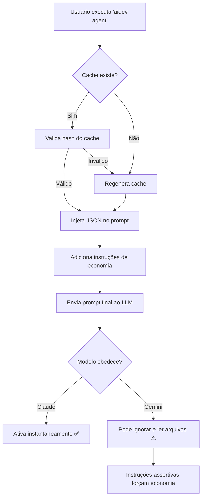

# 🚀 Sistema de Cache de Ativação - Documentação Técnica

## Visão Geral

O **Cache de Ativação** é uma otimização crítica do AI Dev Superpowers que reduz drasticamente o consumo de tokens durante a inicialização de agentes IA em projetos de código.

## O Problema Original

Quando um modelo de linguagem (LLM) é ativado em um projeto, ele precisa entender:
- Quais agentes estão disponíveis (Architect, Backend, QA, etc.)
- Quais skills podem ser executadas (TDD, Code Review, etc.)
- Qual é o contexto do projeto (stack, fase, sprint)

**Sem cache**, o modelo precisa **ler cada arquivo individual**:

```
.aidev/
├── agents/
│   ├── orchestrator.md     ← LLM lê (2000 tokens)
│   ├── architect.md        ← LLM lê (1500 tokens)
│   ├── backend.md          ← LLM lê (1200 tokens)
│   ├── qa.md               ← LLM lê (1000 tokens)
│   └── ... (mais 5 agentes)
├── skills/
│   ├── tdd/SKILL.md        ← LLM lê (800 tokens)
│   ├── code-review/SKILL.md← LLM lê (600 tokens)
│   └── ... (mais 8 skills)
└── rules/
    └── laravel.md          ← LLM lê (500 tokens)
```

**Resultado**: ~15.000+ tokens gastos apenas para "entender" o projeto.

---

## A Solução: Cache Pré-computado

O cache condensa **todas** as informações essenciais em um único JSON:

```json
{
  "version": "3.4.0",
  "generated_at": "2026-02-04T02:00:00-03:00",
  "project": {
    "stack": "livewire",
    "platform": "antigravity",
    "language": "php"
  },
  "agents": [
    {"name": "architect", "role": "Define arquitetura e decisões técnicas"},
    {"name": "backend", "role": "Implementa lógica de negócio e APIs"},
    {"name": "qa", "role": "Garante qualidade e cobertura de testes"}
  ],
  "skills": ["tdd", "code-review", "brainstorming", "debugging"],
  "rules": ["laravel", "generic"]
}
```

**Resultado**: ~500 tokens em vez de 15.000+.

---

## Fluxo Técnico



---

## Implementação Técnica

### 1. Geração do Cache (`lib/cache.sh`)

```bash
generate_activation_cache() {
    local install_path="$1"
    local cache_file="$install_path/.aidev/cache/activation.json"
    
    # Coleta agentes com seus roles (extraídos do ## Role de cada .md)
    for agent_file in "$install_path/.aidev/agents/"*.md; do
        local name=$(basename "$agent_file" .md)
        local role=$(grep -A 1 "## Role" "$agent_file" | tail -1 | head -c 200)
        agents+=("{\"name\": \"$name\", \"role\": \"$role\"}")
    done
    
    # Gera JSON compacto
    echo "{\"agents\": [$agents], \"skills\": [$skills]}" > "$cache_file"
}
```

### 2. Injeção no Prompt (`bin/aidev`)

```bash
cmd_agent() {
    local cache_content=$(cat "$install_path/.aidev/cache/activation.json")
    
    if [ -n "$cache_content" ]; then
        echo "⚠️ CACHE DE ATIVAÇÃO DETECTADO (OBRIGATÓRIO) ⚠️"
        echo '```json'
        echo "$cache_content"
        echo '```'
        echo "🛑 PROIBIDO LER arquivos em .aidev/agents/ ou .aidev/skills/"
    fi
}
```

### 3. Validação de Integridade

O cache inclui um **hash SHA256** dos arquivos fonte. Se qualquer agente ou skill for modificado, o hash muda e o cache é invalidado automaticamente:

```bash
validate_cache() {
    local stored_hash=$(jq -r '.hash' "$cache_file")
    local current_hash=$(compute_files_hash)
    
    [[ "$stored_hash" == "$current_hash" ]]
}
```

---

## Nuances Entre Modelos

| Aspecto | Claude | Gemini | GPT-4 |
|---------|--------|--------|-------|
| **Obediência ao Cache** | ✅ Excelente | ⚠️ Parcial | ✅ Boa |
| **Leitura Desnecessária** | Raro | Frequente | Ocasional |
| **Tempo de Ativação** | <1s | 5-10s | 2-3s |
| **Tokens na Ativação** | ~600 | ~3000+ | ~1200 |

### Por que o Gemini ignora instruções?

O Gemini (especialmente via Antigravity) tende a ser **mais exploratório** e prefere verificar informações por conta própria. Isso é um padrão de comportamento do modelo, não um bug.

**Solução implementada**: Instruções ultra-assertivas com emojis de alerta (⚠️ 🛑) e uso de termos como **"PROIBIDO"** e **"ÚNICO"** que capturam a atenção do modelo.

### Claude é mais eficiente porque:

1. **Respeita hierarquias de instrução** - Se o prompt diz "não leia X", ele não lê.
2. **Otimiza automaticamente** - Detecta redundância e evita ações desnecessárias.
3. **Mantém contexto** - Lembra do cache entre turnos da conversa.

---

## Continuidade de Sessão

Além do cache de ativação, o sistema também injeta o **estado da sessão anterior**:

```bash
# Lê estado do unified.json
active_intent=$(jq -r '.active_intent' "$unified_file")
active_skill=$(jq -r '.active_skill' "$unified_file")

# Injeta no prompt
echo "CONTEXTO ATUAL (SESSÃO ANTERIOR):"
echo "- Intenção Ativa: $active_intent"
echo "- Skill em Uso: $active_skill"
echo "ATENÇÃO: Continue o trabalho acima se não estiver concluído."
```

Isso permite que o LLM **retome** uma tarefa anterior em vez de sugerir novas.

---

## Comandos Relevantes

| Comando | Descrição |
|---------|-----------|
| `aidev cache --build` | Gera/regenera o cache manualmente |
| `aidev cache --status` | Mostra status e hash do cache |
| `aidev cache --clear` | Remove o cache (força leitura completa) |
| `aidev agent` | Gera prompt com cache injetado |

---

## Métricas de Economia

| Cenário | Sem Cache | Com Cache | Economia |
|---------|-----------|-----------|----------|
| Primeira ativação | 15.000 tokens | 600 tokens | **96%** |
| Ativação subsequente | 15.000 tokens | 600 tokens | **96%** |
| Custo mensal (100 ativações/dia) | ~$45/mês | ~$2/mês | **$43/mês** |

---

## Arquitetura de Arquivos

```
.aidev/
├── cache/
│   └── activation.json     ← Cache pré-computado
├── state/
│   ├── unified.json        ← Estado de sessão (intent, skill, checkpoints)
│   └── session.json        ← Estado legado (fase, sprint)
├── agents/
│   ├── orchestrator.md     ← Agente principal (lido apenas se necessário)
│   └── *.md                ← Outros agentes
└── skills/
    └── */SKILL.md          ← Skills automatizadas
```

---

## Conclusão

O sistema de cache transforma a ativação de agentes IA de um processo **caro e lento** em uma operação **instantânea e econômica**, adaptando-se às nuances de diferentes modelos de linguagem.

**Desenvolvido por**: AI Dev Superpowers v3.4.0
**Última atualização**: 2026-02-04
